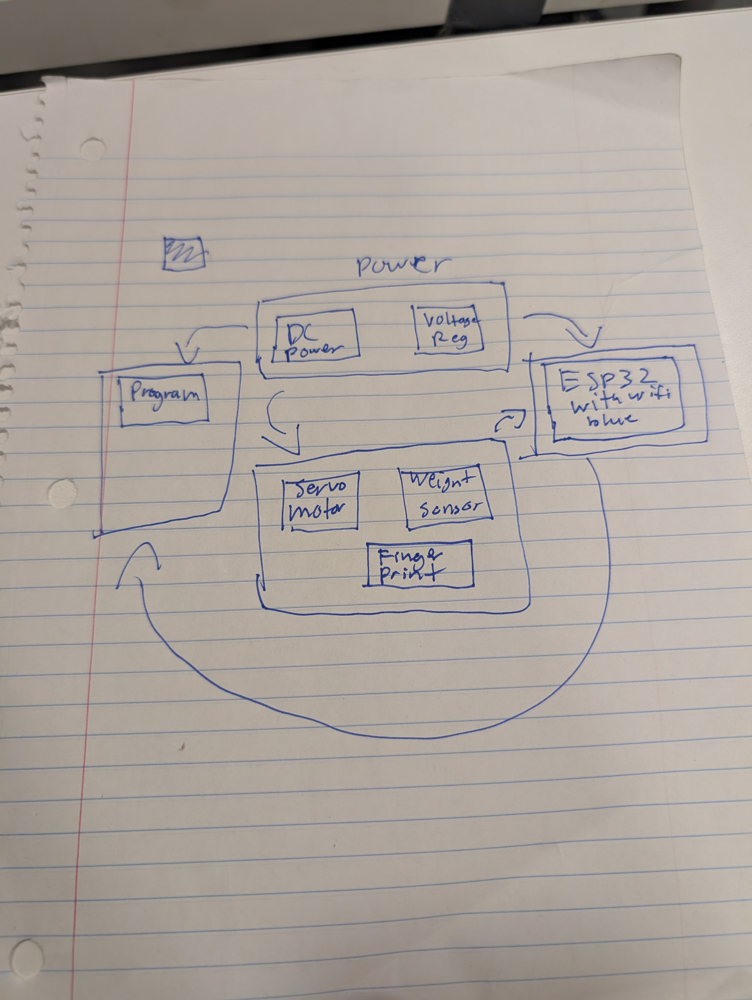

# Week 4

### Overview
*Created a block diagram for how the subsystems will interact and we decided that our three high level requirements are:

Food containment unit is initially locked. Once specified 4 digit codes are inputted into the keypad of the containment unit, the containment unit will unlock.

A 4 digit code is randomly generated upon weight sensor activation. This randomly generated code is intended for 1 time use.

Once the weight sensor detects that the food has been placed inside the containment unit, the unit will lock.*

### Planning

This is a rough draft of our block diagram that we will improve on when writing the proposal.

We have also found parts that we might use in the PCB here is a link to it https://docs.google.com/document/d/1SWdd_iKvCoWNnZnPi8gho3ebCUdIYqPdJ7taNgwGFWw/edit?tab=t.0

All of these parts are ones we might use, but we have to do more research on what exactly is needed.

We have also learned that we need to use a wall plug with an AC to DC converter to power the whole PCB because of the heating
