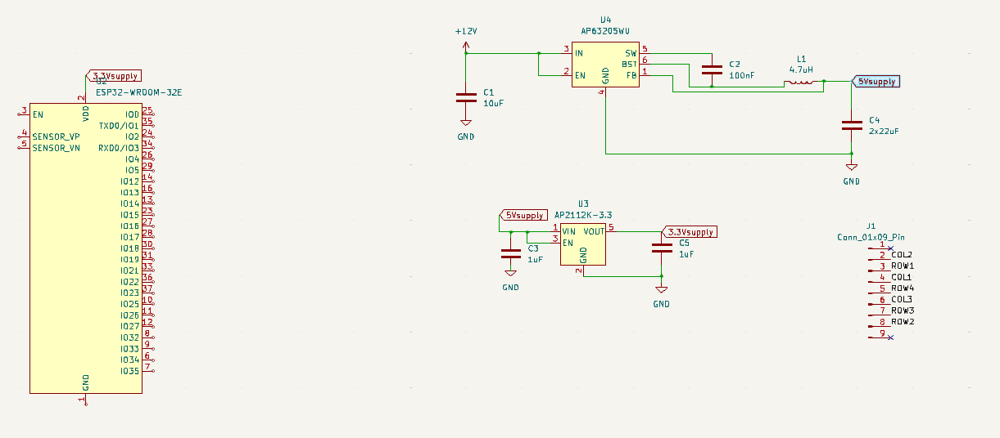

# Week 5

### Overview
*Started making the schematic for the PCB

Presented the proposal to TA's and professor

Started making changes that were recommended by the TA's and professor for the design*

### Planning

This is what we have for the schematic so far it has the ESP 32, some of the power subsystems, and the keypad in it.

We have been thinking about the logic of the heating system right now and what we have so for is the AND 3 things that enable 
which can be set in the program that the user can change, a temperature to see if it is in the range of 25C - 40C, and also 
see if there is a weight of 50 grams or more on the sensor.
